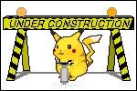

# Svelte Toy

`npm install @leveluptuts/svelte-toy`

```svelte
<script>
	import Toy from '@leveluptuts/svelte-toy/Toy.svelte';
	import { writable } from 'svelte/store';

	let example = writable({
		name: 'John',
		isActive: false
	});
</script>

<h1>Hi, my name is {$example.name}</h1>

{#if $example.isActive}
	<p>I'm active</p>
{/if}

<Toy register={[{ example }]} />
```
